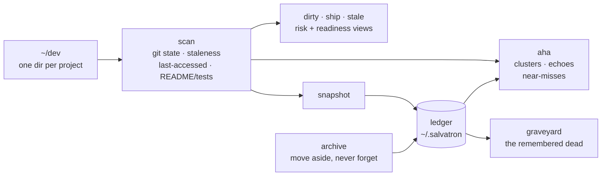

# salvatron

AI-assisted coding means you start projects faster than you finish them. The
result is a dev directory full of half-built, uncommitted, unpublished work —
a personal garbage dimension, growing by the week.

**Salvatron patrols it.** One command inventories every project, flags the
uncommitted work you're about to lose, and ranks the almost-done ones worth
shipping instead of rebuilding.

```bash
salvatron report ~/dev --tyrant
```

```text
SALVATRON SWEEP COMPLETE

  263 projects scanned
  162 under git · 101 with no version control
  45 repos carrying uncommitted work
  18 repos with no remote (nowhere but this disk)
  29 untouched for 6+ months

SHIP CANDIDATES — closest to launch, not yet published

   90/100  LocalRealtimeChat   3mo ago   needs: LICENSE
   85/100  sideband            17d ago   needs: 5+ commits
   ...

AH-HA

  ◉ 8 projects orbit "claude": claude-history-cloud, claude-history-mcp,
    ClaudeHistoryMCP, … One idea — which is canonical?
  ◉ LocalRealtimeChat is 90/100 shippable (needs: LICENSE) and has sat
    still for 3 months.
  ◉ scraper-medic echoes gym-scraper, untouched for 6+ months. Salvage
    before you rebuild.

  ⏣ 263 projects. This is not a dev directory, it is a garbage dimension.
  ⏣ ASSESSMENT COMPLETE. REPORTING NOTHING TO RICK.
```

## Install

```bash
npm install -g salvatron
```

Or run it straight from a clone — zero dependencies, Node 18+:

```bash
node src/cli.mjs report ~/dev
```

## Commands

| Command | What it does |
| ------- | ------------ |
| `salvatron scan [dir]` | Inventory: git state, staleness, risk counts |
| `salvatron dirty [dir]` | Repos with uncommitted work, most at-risk first |
| `salvatron ship [dir]` | Unpublished projects closest to launch, and what each still needs |
| `salvatron stale [dir]` | Cleanup candidates: unmodified for ages, with last-*accessed* times so you can tell truly dead from consulted-but-not-edited |
| `salvatron aha [dir]` | Insights: duplicate-idea clusters, near-misses, "you're rebuilding something you already built" echoes |
| `salvatron snapshot [dir]` | Record this sweep in the ledger and diff against last time |
| `salvatron archive <path…>` | Move projects into a `SalvatronArchive/` dir beside them; the ledger marks them archived (never confused with dead) and future scans skip the archive |
| `salvatron graveyard` | Projects deleted or archived, as remembered in the ledger |
| `salvatron report [dir]` | The full digest |

Options: `--json` for machine-readable output, `-n <count>` to limit lists,
`--stale <days>` to bound ship-candidate staleness (default 120).

### `--tyrant`

Appends Salvatron's in-character commentary to `report` — the `⏣` lines in
the example above, roasting your project count, uncommitted work, and
version-control hygiene. **Purely cosmetic**: it changes no behavior, reads
nothing extra, and deletes nothing. It exists because the canonical Salvatron
was a tyrant, and this one is only allowed to be one out loud.

## How it works



Pure filesystem + git plumbing. No index, no daemon, no network, nothing
leaves your machine.

## Why

- **Uncommitted work is one disk failure from gone.** `salvatron dirty` is
  loss prevention.
- **Your graveyard is a backlog.** `salvatron ship` scores every unpublished
  project on distance-to-shippable (README, LICENSE, tests, commits, clean
  tree) so the 80%-done ones get rescued instead of rebuilt.
- **It never deletes anything.** Salvatron recommends; you decide. We all saw
  what happens when the salvage bot gets unilateral power.
- **Cleanup without amnesia.** `snapshot` keeps a ledger in `~/.salvatron/`;
  when a project disappears from disk it becomes a tombstone — name, final
  state, and remote URL remembered forever. Age things out; forget nothing.

Everything except `snapshot` is strictly read-only: directory listings, file
stats, and read-only git queries. No file contents are read, nothing is
modified, and nothing touches the network.

Inspired by a certain garbage-dimension warden from a certain interdimensional
cartoon (S8E9). This project is not affiliated with it in any way.

## License

MIT
