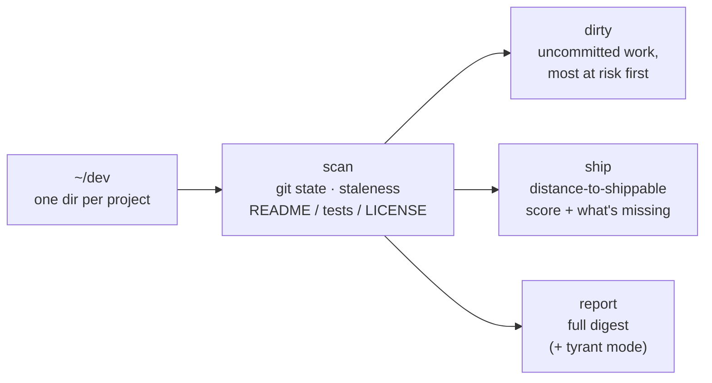

# salvatron

AI-assisted coding means you start projects faster than you finish them. The
result is a dev directory full of half-built, uncommitted, unpublished work —
a personal garbage dimension, growing by the week.

**Salvatron patrols it.** One command inventories every project, flags the
uncommitted work you're about to lose, and ranks the almost-done ones worth
shipping instead of rebuilding.

```bash
salvatron report ~/dev --tyrant
```

```text
SALVATRON SWEEP COMPLETE

  263 projects scanned
  162 under git · 101 with no version control
  45 repos carrying uncommitted work
  18 repos with no remote (nowhere but this disk)
  29 untouched for 6+ months

SHIP CANDIDATES — closest to launch, not yet published

   90/100  LocalRealtimeChat   3mo ago   needs: LICENSE
   85/100  sideband            17d ago   needs: 5+ commits
   ...

  ⏣ 263 projects. This is not a dev directory, it is a garbage dimension.
  ⏣ ASSESSMENT COMPLETE. REPORTING NOTHING TO RICK.
```

## Install

```bash
npm install -g salvatron
```

Or run it straight from a clone — zero dependencies, Node 18+:

```bash
node src/cli.mjs report ~/dev
```

## Commands

| Command | What it does |
| ------- | ------------ |
| `salvatron scan [dir]` | Inventory: git state, staleness, risk counts |
| `salvatron dirty [dir]` | Repos with uncommitted work, most at-risk first |
| `salvatron ship [dir]` | Unpublished projects closest to launch, and what each still needs |
| `salvatron report [dir]` | The full digest |

Options: `--json` for machine-readable output, `-n <count>` to limit lists,
`--stale <days>` to bound ship-candidate staleness (default 120),
`--tyrant` to let Salvatron say what it really thinks.

## How it works



Pure filesystem + git plumbing. No index, no daemon, no network, nothing
leaves your machine.

## Why

- **Uncommitted work is one disk failure from gone.** `salvatron dirty` is
  loss prevention.
- **Your graveyard is a backlog.** `salvatron ship` scores every unpublished
  project on distance-to-shippable (README, LICENSE, tests, commits, clean
  tree) so the 80%-done ones get rescued instead of rebuilt.
- **It never deletes anything.** Salvatron recommends; you decide. We all saw
  what happens when the salvage bot gets unilateral power.

Inspired by a certain garbage-dimension warden from a certain interdimensional
cartoon (S8E9). This project is not affiliated with it in any way.

## License

MIT
